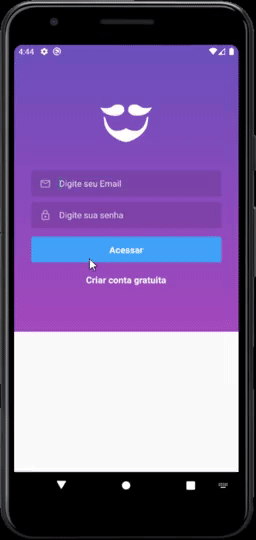

<p align="center">
    
</p>

<h3 align="center">
  Salve o dia e ajude uma ONG local!
</h3>

<p align="center">
  <a href="#rocket-sobre-o-projeto">Sobre o projeto</a> | <a href="#books-guia-de-instalação-e-execução">Guia de instalação e execução</a> | <a href="#page_with_curl-licença">Licença</a> | <a href="#computer-versão-web">Versão Web</a> | <a href="#iphone-versão-mobile">Versão Mobile</a> | <a href="#floppy_disk-backend">Backend</a>
</p>
</p>

## :rocket: Sobre o projeto

<p>Aplicativo com construido durante a Semana Omnistack 11 da Rocketseat.</p>

<p>Aplicativo disponível nas versões:</p>
<h3>
 <ul>
    <li>Web</li>
    <li>Mobile</li>
 </ul>
</h3>
 <p>os dois utilizando o <em>mesmo</em> backend.</p>

# :computer: Versão web

<p>Este aplicativo foi construido utilizando ReactJS</p>
<p>Nesta pagina é possível realizar o cadastramento de ONGs e seus respectivos casos</p>

## Layout


## :blue_book: Tecnologias

- [ReactJS](https://reactjs.org/)
- [React router dom](https://reacttraining.com/react-router/web/guides/quick-start)
- [Axios](https://github.com/axios/axios)
- [React icons](https://react-icons.github.io/react-icons/)

# :iphone: Versão Mobile

<p>Este aplicativo foi construido utilizando React Native</p>
<p>Nesta pagina é possível visualizar todos os casos cadastrados por cada ONG<br />
ao clicar no caso que escolher, abrirá uma pagina com mais informações e <br />
opções de contato como mandar um email ou entrar em contato por Whatsapp.</p>

## Layout



## :blue_book: Tecnologias

- [Typescript](https://www.typescriptlang.org/)
- [React native](https://reactnative.dev/)
- [React navigation 5](https://reactnavigation.org/)
- [React Native Gesture Handler](https://software-mansion.github.io/react-native-gesture-handler/)
- [Axios](https://github.com/axios/axios)
- [Expo](https://expo.io/)
- [Expo icons](https://docs.expo.io/guides/icons/)
- [Expo-constants](hhttps://docs.expo.io/versions/latest/sdk/constants/)
- [Expo-mail-composer](https://docs.expo.io/versions/latest/sdk/mail-composer/)
- [Intl](https://github.com/andyearnshaw/Intl.js#readme)

# :floppy_disk: Backend

<p>O backend foi criado utilzando nodeJS e Express, em formato RESTFUL com estrutura MVC.</p>
<p>Esse backend é responsável por disponibilizar rotas para cadastros de ONGs, <br />
e a entrega desses dados tanto para a web quanto para o mobile.</p>


## :computer: Tecnologias

- [NodeJs](https://nodejs.org/en/)
- [Express](https://expressjs.com/pt-br/)
- [Knex](http://knexjs.org/)
- [SQlite](https://www.sqlite.org/index.html)

## :books: Guia de instalação e execução

### Pré-requisitos

- [Git](https://git-scm.com/)
- [Node.js](https://nodejs.org/en/) >= v10.20

### Expo:

- [IOS](https://apps.apple.com/app/apple-store/id982107779)
- [Android](https://play.google.com/store/apps/details?id=host.exp.exponent)

### Como executar

- Clone o repositório,
- Execute ```yarn``` para instalar as dependências dentro de cada pasta

- Para utilizar a API do backend, entre na pasta server e rode ```yarn dev```

- Para abrir a versão web, entre na pasta web e rode ```yarn start```

- Para ver a versão mobile, instale o expo no seu celular e tenha <br />
certeza de que está conectado na mesma rede que seu PC
- Preencha seu ip de acordo com o da sua maquina no arquivo mobile/services/api.js
- Para iniciar o aplicativo mobile rode ```yarn start```
- Agora abra o aplicativo expo no celular e leia o QR code que aparece na janela aberta

## :page_with_curl: Licença

Esse projeto está sob a licença MIT. Veja o arquivo <a href="https://github.com/fekow/be-the-hero/blob/master/LICENSE">LICENSE</a> para mais detalhes.
