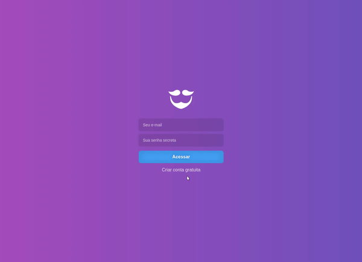
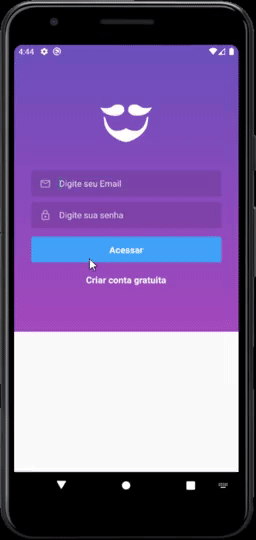
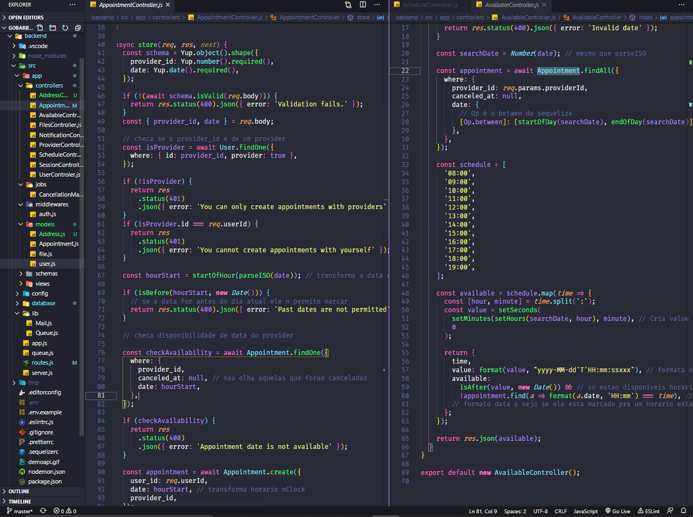

<h1 align="center">
GoBarber</h1>

<p align="center">
  <a href="#rocket-sobre-o-projeto">Sobre o projeto</a> | <a href="#books-guia-de-instalação-e-execução">Guia de instalação e execução</a> | <a href="#page_with_curl-licença">Licença</a> | <a href="#computer-versão-web">Versão Web</a> | <a href="#iphone-versão-mobile">Versão Mobile</a> | <a href="#floppy_disk-backend">Backend</a>
</p>
</p>

## :rocket: Sobre o projeto

<p>Aplicativo feito para um salão de beleza fictício.</p>

<p>Aplicativo disponível nas versões:</p>
<h3>
 <ul>
    <li>Web</li>
    <li>Mobile</li>
 </ul>
</h3>
 <p>os dois utilizando o mesmo backend.</p>

# :computer: Versão web

### Este aplicativo foi construido utilizando React e Typescript

Nessa aplicação é possivel que o prestador de serviço se cadastre com senha e foto e faça login 
no sistema para vizualizar suas marcações para os proximos dias, com notificações 
dinâmicas, além de receber um email automático sempre que tem marcações ou cancelamentos.

## Layout



## :blue_book: Tecnologias

- [ReactJS](https://reactjs.org/)
- [Typescript](https://www.typescriptlang.org/)
- [React router dom](https://reacttraining.com/react-router/web/guides/quick-start)
- [Axios](https://github.com/axios/axios)
- [Redux](https://redux.js.org/)
- [Redux Persist](https://github.com/rt2zz/redux-persist)
- [React Redux](https://react-redux.js.org/)
- [Redux Saga](https://redux-saga.js.org/)
- [Immer](https://immerjs.github.io/immer/docs/introduction)
- [Date fns](https://date-fns.org/)
- [Unform](https://github.com/Rocketseat/unform)
- [React-toastify](https://fkhadra.github.io/react-toastify/introduction)
- [React perfect scrollbar](https://github.com/goldenyz/react-perfect-scrollbar)
- [Styled Components](https://styled-components.com/)
- [Yup](https://github.com/jquense/yup)
- [Polished](https://polished.js.org/)
- [React icons](https://react-icons.github.io/react-icons/)
- [ESLint-Airbnb](https://eslint.org/), [Prettier](https://prettier.io/) e [EditorConfig](https://editorconfig.org/)
- [Reactotron (Saga, Redux)](https://github.com/infinitered/reactotron)

# :iphone: Versão Mobile

### Este aplicativo foi construido utilizando React Native e Typescript

No aplicativo é possivel criar uma conta e realizar login como consumidor,
na primeira página vocÊ visualiza seus agendamentos futuros e passados, podendo 
cancelar os proximos, desde que com tenha no mínimo uma hora de antecedência. 

A pagina de marcação lista todos os cabeleireiros registrados e ao selecionar 
um desses mostra seus horarios disponiveis de acordo com a data selecionada.
Também é possivel atualizar seu cadastro e senha do seu perfil.

## Layout



## :blue_book: Tecnologias

- [Typescript](https://www.typescriptlang.org/)
- [React native](https://reactnative.dev/)
- [React navigation 5](https://reactnavigation.org/)
- [React native Datetimepicker](https://github.com/react-native-community/datetimepicker)
- [React native async storage](https://github.com/react-native-community/async-storage)
- [React Native Gesture Handler](https://software-mansion.github.io/react-native-gesture-handler/)
- [Axios](https://github.com/axios/axios)
- [Redux](https://redux.js.org/)
- [Redux Persist](https://github.com/rt2zz/redux-persist)
- [React Redux](https://react-redux.js.org/)
- [Redux Saga](https://redux-saga.js.org/)
- [Immer](https://immerjs.github.io/immer/docs/introduction)
- [Date fns](https://date-fns.org/)
- [React native linear gradient](https://github.com/react-native-community/react-native-linear-gradient)
- [React native vector icons](https://github.com/oblador/react-native-vector-icons)

# :floppy_disk: Backend

### O backend foi criado utilzando nodeJS e Express, em formato RESTFUL com estrutura MVC.

Esse backend é responsável por disponibilizar as rotas para usuários e provedores
e contem as regras de negócio em seus controladores, como checagem de horários,
intervalo de horários permitidos, cancelamentos e envio de emails automático 
usando templates predefinidos.

Outro papel importante do backend é a interação com o banco de dados, 
que nesse caso utiliza um banco SQL, NoSQL e o Redis. O Redis é um armazenamento
de estrutura de dados de chave-valor, que é utlizado para lidar com a fila para 
envio de emails junto com o bee-queue, que foi criada pra lidar com diversos 
requerimentos de envio de email e que não sobrecarrega o servidor principal, 
possibilitanto que o backend responda mais rapidamente os dados importantes 
enquanto a fila roda em outro processo de fundo.



## :computer: Tecnologias

- [Express](https://expressjs.com/pt-br/)
- [NodeJs](https://nodejs.org/en/)
- [Redis](https://redis.io/)
- [Mongoose](https://mongoosejs.com/)
- [Sequelize](https://sequelize.org/)
- [Bee-queue](https://github.com/bee-queue/bee-queue)
- [Yup](https://github.com/jquense/yup)
- [Cors](https://www.npmjs.com/package/cors)
- [Youch](https://github.com/poppinss/youch)
- [Multer](https://www.npmjs.com/package/multer)
- [Dotenv](https://www.npmjs.com/package/dotenv)
- [Bcryptjs](https://www.npmjs.com/package/bcryptjs)
- [Date fns](https://date-fns.org/)
- [Nodemailer](https://nodemailer.com/about/)
- [Jsonwebtoken](https://jwt.io/)
- [Express Handlebars](https://www.npmjs.com/package/express-handlebars)
- [Express-async-errors](https://www.npmjs.com/package/express-async-errors)
- [Nodemailer-express-handlebars](https://www.npmjs.com/package/nodemailer-express-handlebars)

## :books: Guia de instalação e execução

### Pré-requisitos

- [Git](https://git-scm.com/)
- [Node.js](https://nodejs.org/en/)
- [Yarn](https://yarnpkg.com/)
- Emulador ou Dispositivo físico
- [Docker]()

### Como executar

Para rodar a versão mobile e web tenha sempre o banco de dados e o servidor rodando.

#### Banco de dados

Rode estes comandos para instalar os 3 banco de dados do backend pelo docker.

- `docker run --name redisbarber -p 6379:6379 -d -t redis:alpine`
- `docker run --name database -e POSTGRES_PASSWORD=docker -p 5432:5432 -d postgres`
- `docker run --name mongobarber -p 27017:27017 -d -t mongo`

- O login da database será: 'postgres' e a senha: 'docker'

- Inicie o banco de dados ```docker start redisbarber database mongobarber```

#### Backend

- Clone o repositório,

- Execute ```cd backend``` ```yarn``` para instalar as dependências do servidor.

- Execute ```yarn sequelize db:migrate``` para criar as tabelas

- Execute ```yarn sequelize db:seed:all``` para criar uma entrada do admin

- Para rodar o servidor, abra dois terminais na pasta e rode ``` yarn dev``` e
 ```yarn queue```.

 #### Versão web

- Para abrir a versão web execute ```cd frontend``` e ```yarn``` para instalar
 as dependências.

- Para iniciar rode ```yarn start```.

 #### Versão mobile

#### Acesse <a href="https://react-native.rocketseat.dev">aqui</a> a documentação da Rocketseat para montar seu ambiente Mobile.

### :bulb: Como executar

- Para abrir a versão mobile execute ```cd mobile``` e ```yarn``` para instalar
 as dependências.
 - Preencha seu ip de acordo com o da sua maquina no arquivo mobile/services/api.js
- Usando um emulador rode  ```yarn android``` ou ```yarn ios``` dependendo do 
sistema que estiver usando para instalar o app.
- Para iniciar o aplicativo rode ```yarn start```
- Rode ```adb reverse tcp:8081 tcp:8081``` e ```adb reverse tcp:1337 tcp:1337```
 para o emulador acesar o servidor

<strong>Com um dispositivo físico</strong>

<i>Tenha certeza que está com o modo desenvolvedor ativado e e a opção debugar USB ativada.</i>

- Conecte seu celular pelo cabo USB.
- Verifique se está tudo certo rodando ```adb devices``` e seu dispositivo 
aparecer como device.
- Rode  ```yarn android``` ou ```yarn ios``` dependendo do sistema que estiver 
usando para instalar o app.
- Rode ```yarn start``` para iniciar o aplicativo

## :page_with_curl: Licença

Esse projeto está sob a licença MIT. Veja o arquivo <a href="https://github.com/fekow/gobarber/blob/master/LICENSE">LICENSE</a> para mais detalhes.
